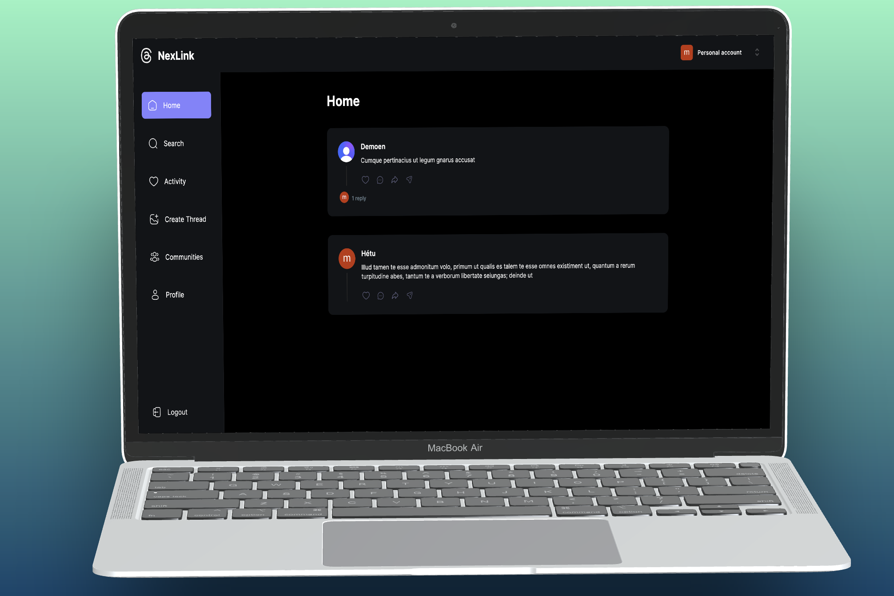

## Building a Fullstack Blog App with React, NextJS, TailwindCSS & MongoDB

Full Stack MERN Next.js 13 NexLink App | React, Next JS, TypeScript, MongoDB

# Technologies
- Next.js 13.4 with Server Side Rendering
- MongoDB handling of complex schemas, multiple data population
- Beautiful layouts with TailwindCSS
- Use Clerk for authentication
- File uploads with UploadThing
- Shadcn components
- Listen to real-time events with webhooks
- Understand middleware, API actions, and authorization
- Explore & integrate new Next.js layout route groups
- Validate data with Zod
- Manage forms with react hook form
- Create reusable components
  
# 🔐 Setup .env file
NEXT_PUBLIC_CLERK_PUBLISHABLE_KEY
CLERK_SECRET_KEY
NEXT_PUBLIC_CLERK_SIGN_IN_URL
NEXT_PUBLIC_CLERK_SIGN_UP_URL
NEXT_PUBLIC_CLERK_AFTER_SIGN_IN_URL
NEXT_PUBLIC_CLERK_AFTER_SIGN_UP_URL
MONGODB_URL
UPLOADTHING_SECRET
UPLOADTHING_APP_ID
NEXT_CLERK_WEBHOOK_SECRET

# Screenshot

