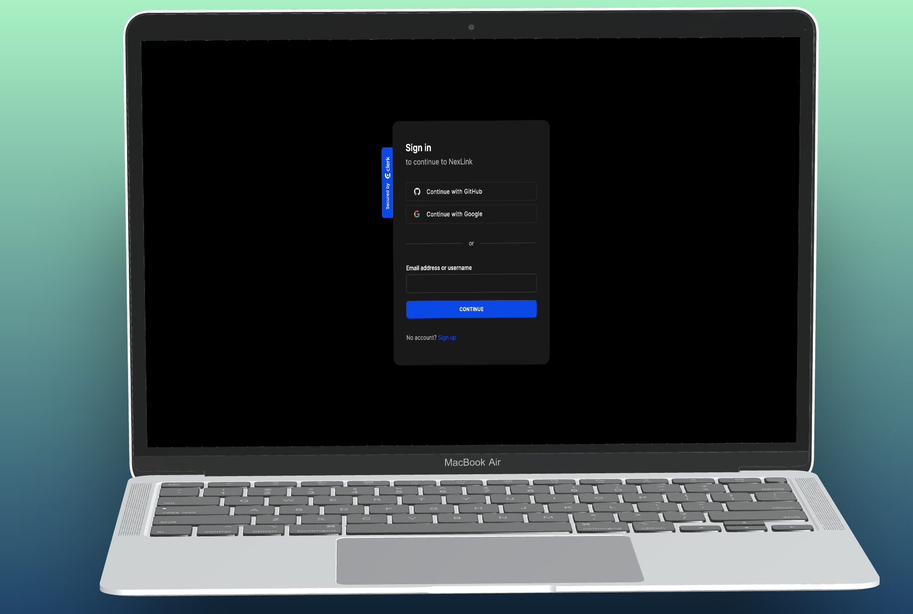

## Building a Fullstack NexLink App with React, NextJS, TailwindCSS & MongoDB

Full Stack MERN Next.js 13 NexLink App | React, Next JS, TypeScript, MongoDB

<!-- Badges -->

# Technologies
- Next.js 13.4 with Server Side Rendering
- MongoDB handling of complex schemas, multiple data population
- Beautiful layouts with TailwindCSS
- Use Clerk for authentication
- File uploads with UploadThing
- Shadcn components
- Listen to real-time events with webhooks
- Understand middleware, API actions, and authorization
- Explore & integrate new Next.js layout route groups
- Validate data with Zod
- Manage forms with react hook form
- Create reusable components
  
# 🔐 Setup .env file
NEXT_PUBLIC_CLERK_PUBLISHABLE_KEY
CLERK_SECRET_KEY
NEXT_PUBLIC_CLERK_SIGN_IN_URL
NEXT_PUBLIC_CLERK_SIGN_UP_URL
NEXT_PUBLIC_CLERK_AFTER_SIGN_IN_URL
NEXT_PUBLIC_CLERK_AFTER_SIGN_UP_URL
MONGODB_URL
UPLOADTHING_SECRET
UPLOADTHING_APP_ID
NEXT_CLERK_WEBHOOK_SECRET

# Screenshot

### Learn More

To learn more about Next.js, take a look at the following resources:

- [Next.js Documentation](https://nextjs.org/docs) - learn about Next.js features and API.
- [Learn Next.js](https://nextjs.org/learn) - an interactive Next.js tutorial.

You can check out [the Next.js GitHub repository](https://github.com/vercel/next.js/) - your feedback and contributions are welcome!

<!-- Deployment -->

### :triangular_flag_on_post: Deployment

To deploy this project run

##### Deploy on Vercel

The easiest way to deploy your Next.js app is to use the [Vercel Platform](https://vercel.com/new?utm_medium=default-template&filter=next.js&utm_source=create-next-app&utm_campaign=create-next-app-readme) from the creators of Next.js.

Check out our [Next.js deployment documentation](https://nextjs.org/docs/deployment) for more details.

